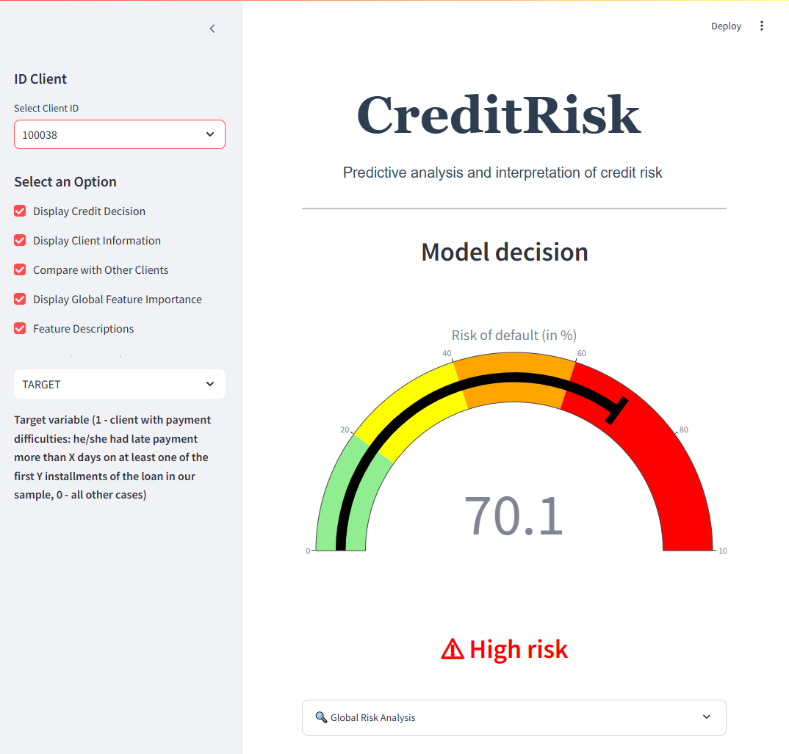
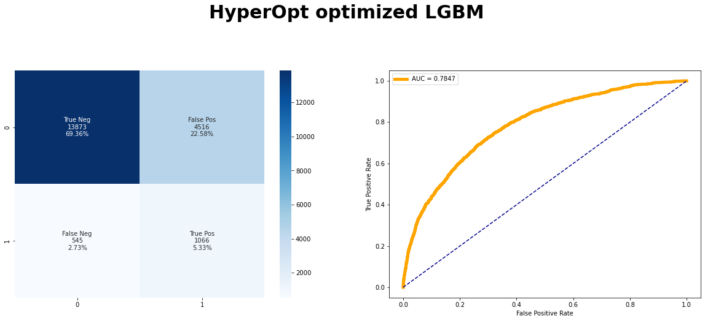

# 📊 **CreditRisk: Predicting Loan Defaults**

# **Summary**:  
This project successfully combines machine learning and business insights to predict loan default probabilities. By focusing on reducing False Negatives (high-risk clients incorrectly classified as low risk), the model minimizes financial losses while maintaining transparency through a user-friendly dashboard. The results demonstrate the business impact of data-driven credit decisions.

## 🏢 **Project Overview**

CreditRisk is a machine learning project designed to predict the likelihood of loan defaults for individuals with limited or no credit history. This project aims to build a robust credit scoring model and provide transparent insights into the predictions using an interactive dashboard.

### **Key Objectives**
- **Determine default probability**: Accurately predict the likelihood of loan default for each client.  
- **Optimize profits**: Focus on reducing False Negatives (high-risk clients incorrectly identified as low risk), which directly impact financial performance.  
- **Ensure transparency**: Provide clear, interpretable insights into credit decisions using an interactive dashboard to build trust with stakeholders.  
  
---

## 📚 **Dataset Description**
The data and their descriptions are available on the Kaggle competition website: Home Credit Default Risk.
The dataset contains over **300,000 loan applications** with 122 features before feature engineering. The target variable (`TARGET`) indicates:
- `0`: Loan was repaid.
- `1`: Loan was not repaid.

### **Key Characteristics**
- **Data Sources**: Main training dataset, test dataset, and auxiliary datasets for feature enrichment.
- **Imbalance**: ~92% of loans were repaid, and only ~8% defaulted.

---

## 🔍 **Exploratory Data Analysis**

- The dataset exhibits significant class imbalance.
- External score variables (`EXT_SOURCE`) are negatively correlated with the target, indicating higher scores suggest better repayment likelihood.
- Age (`DAYS_BIRTH`) and external scores show correlations, suggesting younger applicants are at higher risk of default.

---

## ⚙️ **Methodology**

### **1. Feature Engineering**
- **Created Features**: Loan-to-income ratios, summary statistics from related datasets (e.g., approved/rejected credit history).
- **Techniques**:
  - One-hot encoding for categorical variables.
  - Grouping and aggregation (min, max, mean, sum, variance) across related datasets.
- **Outcome**: Increased the number of features to 798.

### **2. Data Preprocessing**
- **Sampling**: Selected a sample of 100,000 clients to reduce computational load.
- **Imputation**: Filled missing values using the median strategy.
- **Normalization**: Applied MinMaxScaler to scale features to a 0–1 range.

### **3. Model Training and Evaluation**
- Models tested:
  - **Baseline**: DummyClassifier.
  - **Logistic Regression**.
  - **Random Forest**.
  - **LightGBM (LGBM)**: Selected as the best-performing model.
- **Cross-Validation**: 5-fold cross-validation with hyperparameter optimization using GridSearchCV.
- **Metric**: AUC (Area Under the ROC Curve) to evaluate model performance.

### **4. Addressing Class Imbalance**
- **Techniques**:
  - Undersampling (RandomUnderSampler).
  - Oversampling (SMOTE).
  - Class weighting (`class_weight='balanced'`).

### **5. Custom Cost Function**
A custom cost function was created to prioritize reducing **False Negatives (FN)** over **False Positives (FP)**, reflecting the business's financial priorities.

#### Definitions:
- **False Negative (FN)**: The model predicts a client will repay their loan (low risk), but they default (high risk).  
  - **Impact**: Leads to direct financial loss, as the loan principal is not repaid.
- **False Positive (FP)**: The model predicts a client will default (high risk), but they actually repay (low risk).  
  - **Impact**: Results in missed revenue, as creditworthy clients are wrongly denied loans.

#### Why Prioritize FNs?
False Negatives are more costly than False Positives because they lead to direct financial losses, while False Positives only represent missed revenue opportunities. Reducing FNs ensures better risk management and minimizes losses.

#### Optimization Strategy:
- Used **Bayesian Optimization** (HyperOpt) with a custom cost function that heavily penalizes False Negatives.
- Adjusted weights in the cost function to align with the institution's financial goals.

#### Results:
- Reduced False Negatives from **563 to 545**, minimizing high-risk loans and improving overall model reliability.

---

## 🏆 **Results**

### **Best Model**: LightGBM with Balanced Class Weight
- **AUC**: 0.785, highest among all tested models. A higher AUC ensures more accurate identification of risky and reliable clients, minimizing losses and maximizing approved loans
- **Training Time**: Reasonable for deployment.

### **Optimization Impact**
- Reduced **False Negatives (FN)** from 563 to 545, addressing the most costly prediction errors for the business.
  

### **Interpretable Results**
- **Global Feature Importance**:
  - Key drivers include `EXT_SOURCE_3`, `EXT_SOURCE_2`, and `DAYS_BIRTH`.
- **Local Interpretations**:
  - Used SHAP to provide detailed explanations for individual predictions.

---

## 💻 **Interactive Dashboard Demo**

The project includes an interactive dashboard that was previously hosted on Heroku. Due to Heroku’s recent policy change ending free hosting services, the dashboard is no longer live. However, detailed instructions for setting up and running the dashboard locally are provided in Project Structure below. 

https://github.com/user-attachments/assets/c12f66ef-31ed-4008-a8f6-466a66160254
> **Note:** This gauge illustrates the risk of default as predicted by the model. The thresholds (e.g., 20%, 40%, 60%) help classify clients into risk levels:  
> - **Green (0-20%)**: Low risk, likely to repay.  
> - **Yellow (20-40%)**: Moderate risk.  
> - **Orange (40-60%)**: Elevated risk.  
> - **Red (60-100%)**: High risk, likely to default.
 
> Adjusting the decision threshold (e.g., setting it at 60%) allows the institution to reduce False Negatives by rejecting clients with a high predicted risk of default, aligning decisions with business risk tolerance. The 60% threshold was determined by analyzing the expected statistical gain across different thresholds.
> It represents the point where the trade-off between minimizing False Negatives (high-risk clients classified as low risk) and maximizing the business objective of reducing financial losses is optimized.
>  This threshold can be further refined based on more detailed domain knowledge or changes in the institution's strategic objectives.

https://github.com/user-attachments/assets/1faf7368-595f-48f4-a074-173a5db44d5c
> **Note**: An analyst can select a specific client, view their risk score, and understand the factors driving the model's decision through interactive visualizations.

### **Features**:
- Visualize the credit score and its interpretation for each client.
- Compare individual client data against the overall dataset or a group of similar clients.
- Provide transparency and explainability for non-expert stakeholders.

---

## 📈 **Business Impact**

CreditRisk provides significant value for financial institutions by:
1. **Reducing Operational Risk**: Identifying high-risk clients effectively minimizes default rates.
2. **Maximizing Revenue**: By approving good clients, the bank can increase profits.
3. **Enhancing Transparency**: The dashboard allows for clear communication of credit decisions, improving customer trust.

---

## 🚀 **Future Improvements**

1. **Refine Cost Function**:
   - Collaborate with domain experts to adjust the weights for False Positives and False Negatives.
2. **Threshold Optimization**:
   - Analyze business trade-offs to select the most profitable decision threshold.
3. **Advanced Feature Engineering**:
   - Incorporate additional external datasets or temporal features.
4. **Enhanced Dashboard**:
   - Add comparative analysis and deeper insights for credit officers.

---

## 📁 **Project Structure**

The project is divided into two main repositories:

- **Back-End Repository**: [CreditRisk Back-End](https://github.com/alexisMarceau1/CreditRisk_backend)
  Includes all necessary files and instructions to deploy the API.

- **Front-End Repository**: [CreditRisk Front-End](https://github.com/alexisMarceau1/CreditRisk_frontend) 
  Contains the code and setup instructions for running the interactive dashboard locally.

Both repositories include comprehensive documentation to help set up and execute the project locally.

### **Why Predictions Are Handled via API ?**

Predictions are processed through a back-end API for the following reasons:
- **Improved Performance**: Offloads heavy computations to the server, keeping the interface fast and responsive.
- **Scalability**: Centralized processing allows seamless handling of multiple requests.
- **Enhanced Security**: Ensures sensitive data is processed safely on the server side.
- **Ease of Maintenance**: Simplifies model updates without requiring changes to the front end.

This architecture ensures a streamlined user experience while adhering to modern best practices.

---

## 📫 **Contact**

If you have any questions or want to discuss the project further, feel free to reach out:

**Alexis Marceau**  
📧 [alexis.marceau.12@gmail.com](mailto:alexis.marceau.12@gmail.com)  
🔗 [LinkedIn](https://www.linkedin.com/in/alexis-marceau)  

---

